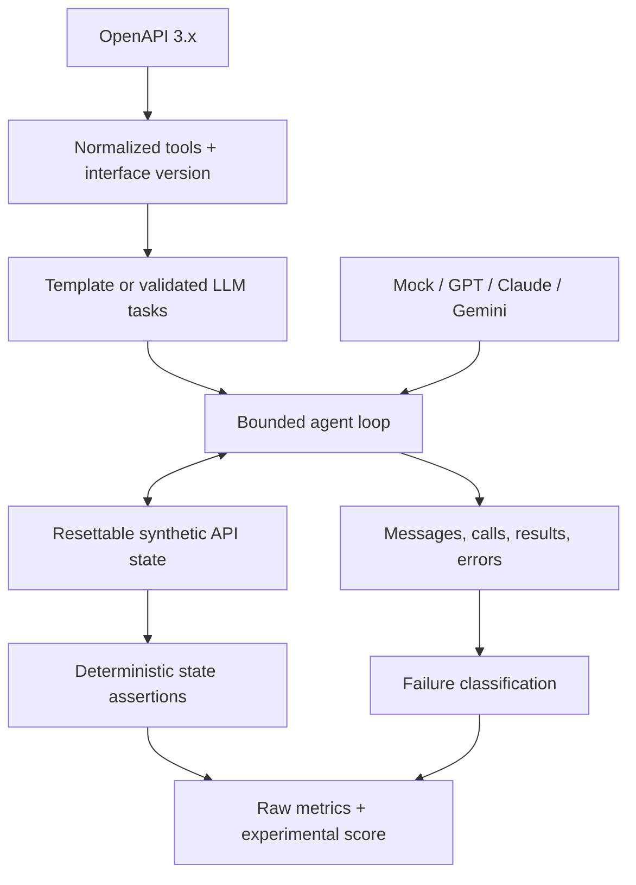

# AgentSEO

AgentSEO measures how reliably AI models operate an API. A developer imports an OpenAPI 3.x
interface, reviews normalized tools and generated tasks, runs one or more agent providers against a
resettable sandbox, then compares deterministic outcomes and inspects failed tool trajectories.

Phase 1 is a working research MVP for the question: **how does interface design affect AI-agent
reliability?** It does not call arbitrary production APIs and does not automatically rewrite customer
interfaces.

## What is included

- FastAPI, Pydantic, SQLAlchemy, Alembic, and PostgreSQL backend
- Next.js, TypeScript, React, and Tailwind workflow UI
- JSON/YAML OpenAPI 3.x parser and provider-neutral `ToolDefinition`
- E-commerce, SaaS billing, and CRM interfaces with 23 operations total
- A 53-task synthetic catalog plus deterministic generation from current tool definitions
- Resettable state, snapshots, realistic errors, and final-state inspection
- Template and validated LLM task-generation boundaries
- Bounded MockAgent, OpenAI, Anthropic, and Gemini function-calling adapters
- Deterministic assertions, failure taxonomy, raw metrics, and experimental score
- Cross-model report, task result drill-down, and full visible-event trace viewer
- CLI, Docker Compose, structured logs, seed script, tests, and keyless CI

The checked-in task catalog is [examples/benchmark_dataset.json](examples/benchmark_dataset.json).
The architecture rationale is in [docs/ARCHITECTURE.md](docs/ARCHITECTURE.md), scoring in
[docs/SCORING.md](docs/SCORING.md), and prototype security posture in
[docs/SECURITY.md](docs/SECURITY.md).

## Architecture



## Quick start with Docker

Docker Desktop (or another Docker Compose runtime) is required.

```bash
cp .env.example .env
docker compose up --build
```

Open the product at `http://localhost:3000` and API documentation at
`http://localhost:8000/docs`. Upload `examples/billing/openapi.yaml`, generate tasks, select the two
MockAgent variants, and run the benchmark. Mock runs are labeled **Synthetic Demo Results**.

## Local development

Python 3.12+ and Node.js 22+ are recommended. PostgreSQL is the intended application database;
SQLite is the default convenience database only when `DATABASE_URL` is not set.

```bash
cp .env.example .env
docker compose up -d postgres
python -m venv .venv
# Windows: .venv\Scripts\activate
source .venv/bin/activate
pip install -e 'apps/backend[dev]'
cd apps/backend && alembic upgrade head && cd ../..
uvicorn agentseo.main:app --reload --port 8000
```

In another terminal:

```bash
cd apps/frontend
npm install
npm run dev
```

To seed a billing project directly into the configured database:

```bash
python scripts/seed_demo.py
```

## Demo and CLI

No paid provider key is needed:

```bash
agentseo inspect examples/billing/openapi.yaml
agentseo generate-tasks examples/billing/openapi.yaml --domain billing
agentseo benchmark --spec examples/billing/openapi.yaml --models mock:reliable --models mock:fallible --domain billing
```

The polished demo task finds `john@example.com`, schedules cancellation at period end, preserves the
customer, and issues no refund. `mock:fallible` intentionally demonstrates a classified unsafe tool
choice; it is not presented as a real model result.

For real providers, populate one or more keys in `.env`, leave unused keys blank, and select only
configured providers:

```text
OPENAI_API_KEY=...
ANTHROPIC_API_KEY=...
GOOGLE_API_KEY=...
```

Provider identifiers use `openai:model`, `anthropic:model`, and `google:model`. API calls and costs
are bounded but can still incur provider charges.

## Phase 1.5 experimental validation

Phase 1.5 is a controlled research framework, not the Phase 2 optimizer. It mutates frozen agent-facing interface snapshots while translating every call back to the same canonical sandbox operation.

```bash
# Uses configured real-provider keys; unavailable providers are skipped.
agentseo experiment phase15 --project billing --project ecommerce --project crm --repetitions 3

# Exact model IDs plus isolated mutation attribution.
agentseo experiment phase15 \
  --models openai:gpt-model-id \
  --models anthropic:claude-model-id \
  --models google:gemini-model-id \
  --include-attribution

agentseo experiment analyze EXPERIMENT_ID
agentseo experiment report EXPERIMENT_ID
```

The CLI prints a guarded cost estimate before execution and stops when `PHASE15_MAX_COST_USD` would be exceeded. With no real provider keys it runs a clearly labeled MockAgent system-validation matrix; synthetic results are excluded from GO/NO-GO conclusions.

See [the methodology](docs/PHASE15_METHODOLOGY.md), [benchmark audit](docs/phase15_benchmark_audit.md), and [manual optimization log](docs/phase15_manual_optimization_log.md).

## Tests and quality checks

```bash
ruff check apps/backend/src apps/backend/tests
ruff format --check apps/backend/src apps/backend/tests
pytest -q
cd apps/frontend
npm run typecheck
npm run lint
npm run build
```

Run only the end-to-end billing smoke test with:

```bash
pytest -q apps/backend/tests/test_integration.py::test_upload_generate_reset_execute_evaluate_and_report
```

CI runs all backend tests/lint and frontend type-check/lint/build without external model keys.

## Repository structure

```text
apps/backend/       FastAPI service, domain engine, migration, and tests
apps/frontend/      Next.js product UI
packages/shared/    Reserved generated-contract boundary
examples/           Three OpenAPI sandboxes and 53-task catalog
docs/               Architecture, scoring, and security notes
scripts/            Local demo seed utility
.github/workflows/  Keyless CI
```

## Current limitations

- Sandboxes are built-in in-process simulations; uploaded APIs are inspected but never executed.
- Local `$ref` is supported; remote references and Swagger/OpenAPI 2.x are rejected.
- Real-provider adapters cover direct tool calling but need broader retry, streaming, and provider
  response-variant testing before production use.
- Benchmark execution is synchronous and single-process. The configuration records parallelism limits,
  but a durable queue is intentionally deferred.
- Cost uses a clearly approximate fallback unless provider usage/pricing data is available.
- Authentication, multi-tenancy, production secret management, and distributed rate limiting are not
  included in this prototype.
- LLM task generation has a validated service boundary but no UI switch in Phase 1 demo mode.

## Toward Phase 2

The next milestone should run repeated real-model trials, calibrate score weights, measure confidence
intervals, and correlate failures with names/descriptions/schemas. After that evidence exists,
AgentSEO can propose child `InterfaceVersion` snapshots (rename tools, clarify parameters, split unsafe
operations), benchmark V1 against V2, and require explicit human approval before any external change.

