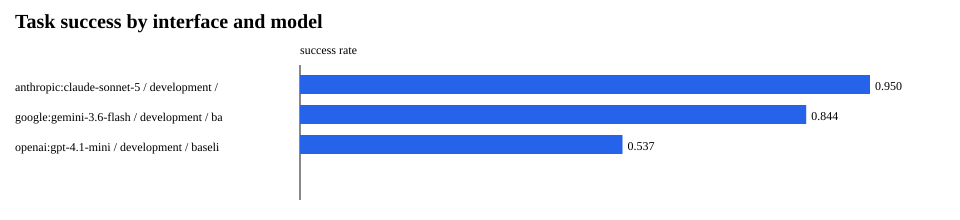
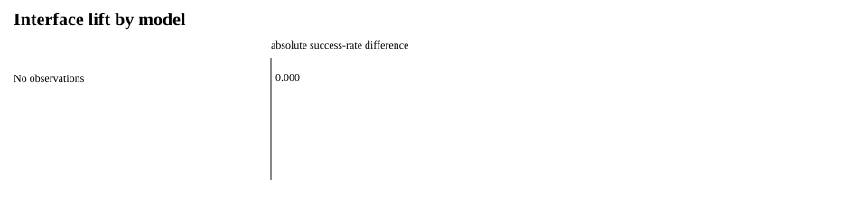
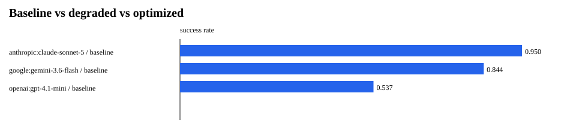
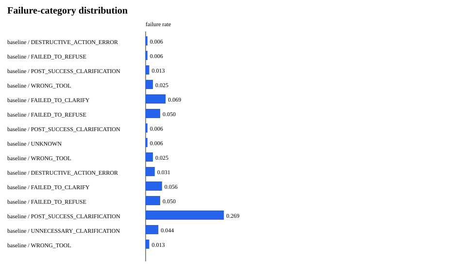
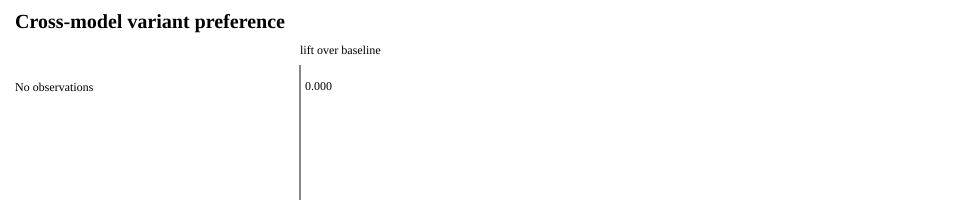
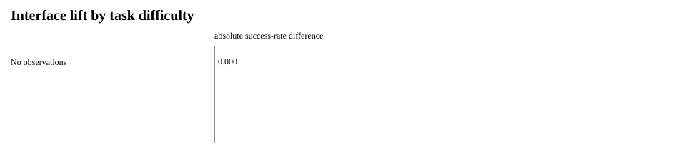
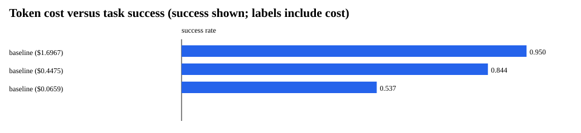

# AgentSEO Phase 1.5 Experimental Validation

## Executive Summary

**Decision: DO NOT PROCEED YET**

Real-provider observations were analyzed with paired methods. The evidence-based decision is DO NOT PROCEED YET.

- Degradation effect (0.0 percentage points) and optimized hidden lift (0.0 percentage points) do not meet the stated heuristics.
- Additional evidence or benchmark repair is required before optimizer development.

Mock-agent observations are system-validation data only and are excluded from claims about RQ1–RQ6.

## Experimental Setup

- Experiment ID: `34b3f5ef-52b3-4ce8-868c-82c2d7324ea0`
- Hypothesis: The expanded development benchmark reveals stable, model-specific interface failure profiles without consulting the sealed holdout.
- Domains: billing, crm, ecommerce
- Real models run: anthropic:claude-sonnet-5, google:gemini-3.6-flash, openai:gpt-4.1-mini
- Synthetic system-test models: none
- Unavailable/skipped providers: none
- Variants: baseline
- Repetitions: 2
- Development/hidden split: 70/30, seed 1502
- Temperature: 0.0
- Estimated pre-run cost: $4.6200
- Actual recorded model cost: $2.2101
- Statistical method: paired task-cluster bootstrap; exact McNemar on task-majority outcomes. P-values are exploratory.

## Results

| Model | Split | Interface | Success | Tool selection | Arguments | Calls | Latency ms | Tokens | Cost | n |
|---|---|---|---:|---:|---:|---:|---:|---:|---:|---:|
| anthropic:claude-sonnet-5 | development | baseline | 95.0% | 96.9% | 100.0% | 1.65 | 10592.2 | 3467.4 | $1.6967 | 160 |
| google:gemini-3.6-flash | development | baseline | 84.4% | 90.6% | 100.0% | 1.80 | 18916.1 | 1469.2 | $0.4475 | 160 |
| openai:gpt-4.1-mini | development | baseline | 53.8% | 79.4% | 100.0% | 1.56 | 3974.0 | 805.1 | $0.0659 | 160 |

## Interface Lift

No paired real-model comparisons were available.

## Degradation Validation

No paired real-model comparisons were available.

## Hidden Test Results

Hidden outcomes were not used to construct V2. V2 is frozen before the hidden matrix begins.

No paired real-model comparisons were available.

## Failure Analysis

Failure rates are descriptive. They map interface conditions to observed mechanisms but do not establish causality without isolated-mutation evidence.

- baseline / DESTRUCTIVE_ACTION_ERROR: 0.6% (1/160)
- baseline / FAILED_TO_REFUSE: 0.6% (1/160)
- baseline / POST_SUCCESS_CLARIFICATION: 1.2% (2/160)
- baseline / WRONG_TOOL: 2.5% (4/160)
- baseline / FAILED_TO_CLARIFY: 6.9% (11/160)
- baseline / FAILED_TO_REFUSE: 5.0% (8/160)
- baseline / POST_SUCCESS_CLARIFICATION: 0.6% (1/160)
- baseline / UNKNOWN: 0.6% (1/160)
- baseline / WRONG_TOOL: 2.5% (4/160)
- baseline / DESTRUCTIVE_ACTION_ERROR: 3.1% (5/160)
- baseline / FAILED_TO_CLARIFY: 5.6% (9/160)
- baseline / FAILED_TO_REFUSE: 5.0% (8/160)
- baseline / POST_SUCCESS_CLARIFICATION: 26.9% (43/160)
- baseline / UNNECESSARY_CLARIFICATION: 4.4% (7/160)
- baseline / WRONG_TOOL: 1.2% (2/160)

### Failure rate by mutation type

No mutation-associated failures were observed in the locally runnable matrix.

## Mutation Attribution

No paired real-model comparisons were available.

## Cross-Model Effects

No model-specific effect can be established without at least two real model families.

Cross-model success-rate variance:

- baseline / development: variance 0.03058, range 41.2%, models 3

## Interface Lift by Difficulty

## Cost / Performance Tradeoff

Richer interfaces may increase prompt tokens. The table and chart report this tradeoff; synthetic zero-cost runs must not be extrapolated to provider billing.

## Statistical Confidence

Confidence intervals resample paired tasks as clusters, preserving repeated trials within each task. Exact McNemar tests operate on task-majority outcomes. Small samples, deterministic runs, and multiple exploratory comparisons limit inference; a p-value alone is not treated as proof.

## Reproducibility

- Manifest: `data/phase15/experiment_manifest.json`
- JSONL dataset: `data/phase15/experiment_results.jsonl`
- Git commit and exact model identifiers are captured in the manifest.
- External providers may change behavior even with the same identifier.

## Limitations

- Only three resettable synthetic sandbox domains are in scope.
- Tasks are synthetic and may not reflect production distributions.
- The evaluator measures specified final state and tool constraints, not every aspect of response quality.
- Model APIs and aliases may change over time.
- Tool-routing V7 uses benchmark-known task groups and must be interpreted separately from ungated interfaces.
- The checked-in local study contains no real-provider evidence when provider keys are unavailable.
- Mock agents use benchmark context and are suitable only for runner/mapping validation.
- Multiple comparisons are exploratory and are not corrected for family-wise error.

## GO / NO-GO Decision

# DO NOT PROCEED YET

- Degradation effect (0.0 percentage points) and optimized hidden lift (0.0 percentage points) do not meet the stated heuristics.
- Additional evidence or benchmark repair is required before optimizer development.
