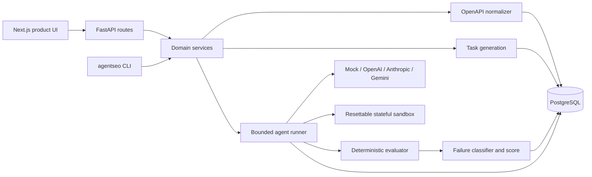

# Architecture

AgentSEO is a modular monolith: one FastAPI service owns experiment logic and persistence, one
Next.js application presents the workflow, and PostgreSQL stores reproducible experiment records.
The boundary is intentionally simple for Phase 1.

## Module boundaries

- `openapi_parser.py` accepts JSON/YAML OpenAPI 3.x and emits provider-neutral tools.
- `task_generation.py` supports offline templates and validated structured LLM generation.
- `providers.py` normalizes provider tool calls behind `AgentProvider.next_action`.
- `sandboxes.py` owns deterministic state, reset, execution, snapshot, and realistic errors.
- `runner.py` enforces timeout/iteration/tool-call bounds and persists every visible event.
- `evaluation.py` evaluates state assertions, classifies failure signals, and calculates metrics.
- `api.py` and `cli.py` are delivery layers; domain behavior is not implemented in route handlers.

## Reproducibility and Phase 2

Each run records the exact model, interface version, task versions, configuration, state assertions,
metrics, and trace. `InterfaceVersion` snapshots source-derived tool definitions and supports parent
links. Phase 2 can create a child version with proposed naming/schema changes and benchmark it
against the same tasks without mutating the customer's source interface.

