# Phase 2A architecture

```mermaid
flowchart LR
  Git["Target + PR refs"] --> Source["OpenAPIInterface"]
  Source --> Tools["Normalized ToolDefinition"]
  Tools --> Diff["Semantic InterfaceDiff"]
  Contracts["Agentic Compatibility Contracts"] --> Select["FULL_SUITE / AFFECTED_ONLY"]
  Diff --> Select
  Select --> Pair["Paired compatibility runner"]
  Pair --> Base["Baseline InterfaceVersion"]
  Pair --> Candidate["Candidate InterfaceVersion"]
  Base --> Sandbox["Resettable sandbox + deterministic evaluator"]
  Candidate --> Sandbox
  Sandbox --> Results["CompatibilityResult"]
  Results --> Policy["Transparent PASS / WARNING / FAIL rules"]
  Policy --> GitHub["PR Markdown + status exit code"]
```

`CompatibilityRun` owns refs, commits, frozen interfaces, models, suite fingerprint, selection,
costs, verdict, classification, diff, metrics, provider configuration, and reproducibility metadata.
`CompatibilityResult` stores paired per-model/task outcomes and resource deltas. The runner reuses
the Phase 1 provider, sandbox, evaluation, trace, pricing, and persistence paths.

## MCP preparation

`InterfaceSource` defines the shared normalization boundary. `OpenAPIInterface` implements it today;
`MCPInterface` reserves the Phase 2E adapter. Phase 2E must still define MCP server discovery,
tool-list snapshot capture, JSON Schema normalization edge cases, authentication/transport handling,
resources/prompts semantics, server lifecycle isolation, and reproducible fixture execution. Full MCP
support is deliberately not a Phase 2A blocker.

## Deferred work

Durable distributed workers, statistically validated impact selection, arbitrary customer backend
execution, remote `$ref`, multi-tenant secret management, retries/status APIs, and Agentic SemVer are
post-MVP work. No automated interface optimizer or model-specific compiler is part of this product.
