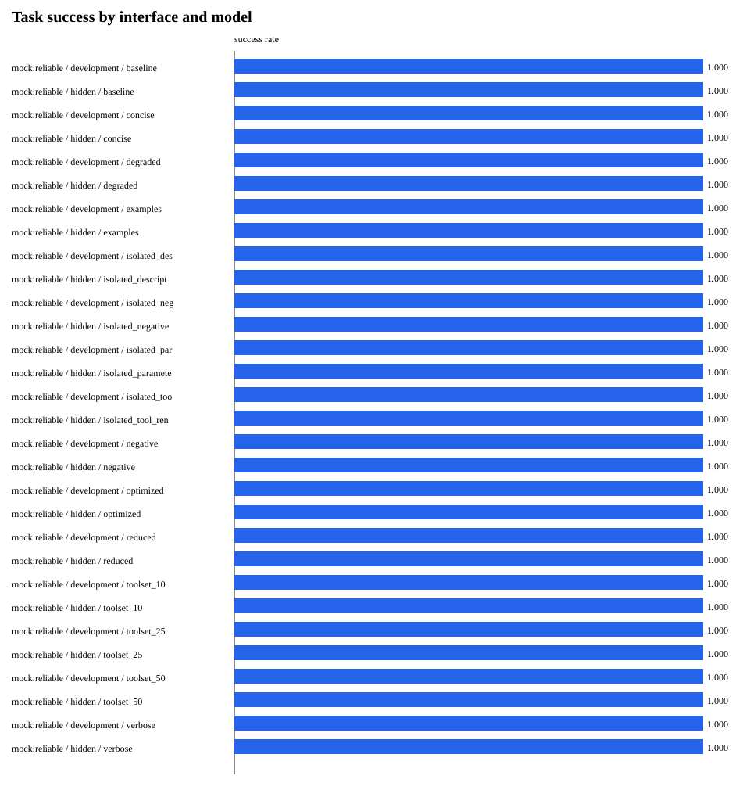
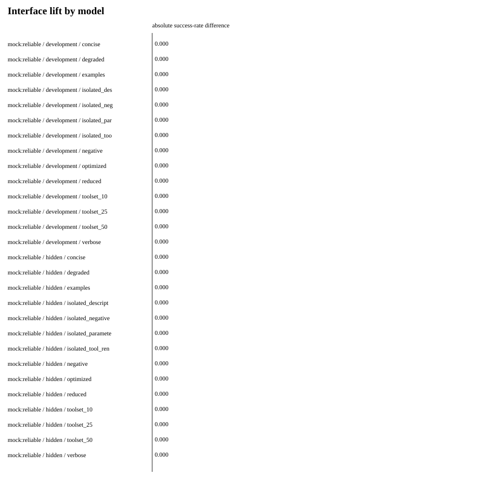
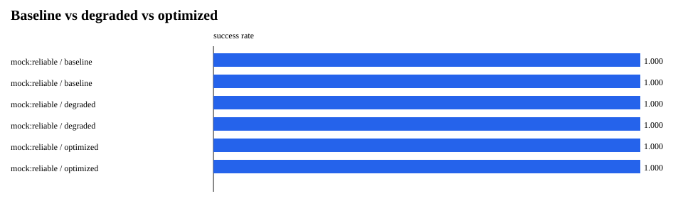
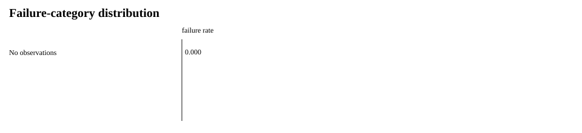
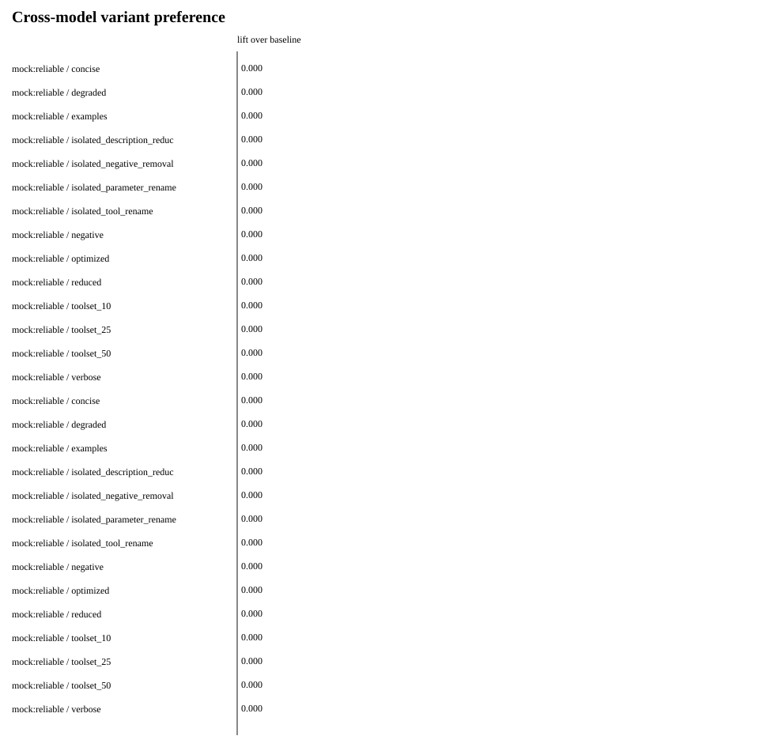
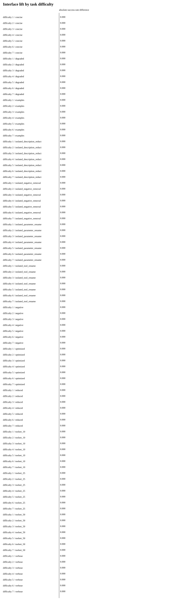
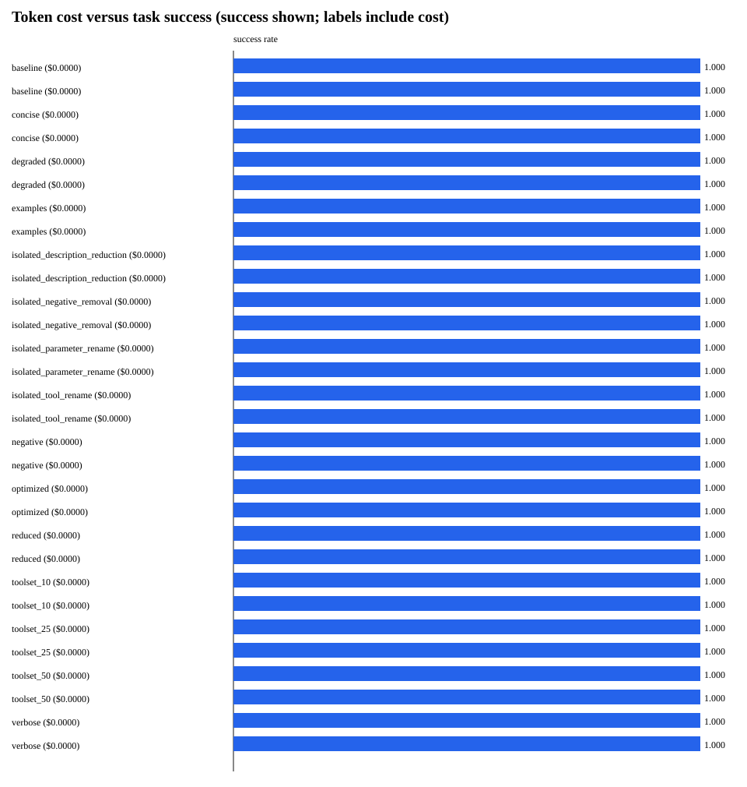

# AgentSEO Phase 1.5 Experimental Validation

## Executive Summary

**Decision: DO NOT PROCEED YET**

The experimental system is ready, but the locally available evidence cannot validate or falsify interface sensitivity because only MockAgent system tests were runnable.

- No real-provider API keys were configured, so the central hypothesis has not been tested on GPT, Claude, or Gemini.
- The synthetic matrix validates persistence, interface translation, repetition, statistics, export, and reporting only.
- Run the frozen manifest with real providers before authorizing Phase 2 optimizer work.

Mock-agent observations are system-validation data only and are excluded from claims about RQ1–RQ6.

## Experimental Setup

- Experiment ID: `f67c4e98-9d5b-4046-bed3-2ed5889a5bbb`
- Hypothesis: Changing only the agent-facing tool interface materially changes reliable task completion, and targeted changes produce repeatable, potentially model-specific lift.
- Domains: billing, crm, ecommerce
- Real models run: none
- Synthetic system-test models: mock:reliable
- Unavailable/skipped providers: openai (API key unavailable), anthropic (API key unavailable), google (API key unavailable)
- Variants: baseline, concise, degraded, examples, isolated_description_reduction, isolated_negative_removal, isolated_parameter_rename, isolated_tool_rename, negative, optimized, reduced, toolset_10, toolset_25, toolset_50, verbose
- Repetitions: 3
- Development/hidden split: 70/30, seed 42
- Temperature: 0.0
- Estimated pre-run cost: $0.0000
- Actual recorded model cost: $0.0000
- Statistical method: paired task-cluster bootstrap; exact McNemar on task-majority outcomes. P-values are exploratory.

## Results

| Model | Split | Interface | Success | Tool selection | Arguments | Calls | Latency ms | Tokens | Cost | n |
|---|---|---|---:|---:|---:|---:|---:|---:|---:|---:|
| mock:reliable | development | baseline | 100.0% | 100.0% | 100.0% | 1.32 | 0.3 | 105.0 | $0.0000 | 114 |
| mock:reliable | hidden | baseline | 100.0% | 100.0% | 100.0% | 1.33 | 0.4 | 105.7 | $0.0000 | 45 |
| mock:reliable | development | concise | 100.0% | 100.0% | 100.0% | 1.32 | 0.4 | 105.0 | $0.0000 | 114 |
| mock:reliable | hidden | concise | 100.0% | 100.0% | 100.0% | 1.33 | 0.4 | 105.7 | $0.0000 | 45 |
| mock:reliable | development | degraded | 100.0% | 100.0% | 100.0% | 1.32 | 0.4 | 105.0 | $0.0000 | 114 |
| mock:reliable | hidden | degraded | 100.0% | 100.0% | 100.0% | 1.33 | 0.4 | 105.7 | $0.0000 | 45 |
| mock:reliable | development | examples | 100.0% | 100.0% | 100.0% | 1.32 | 0.5 | 105.0 | $0.0000 | 114 |
| mock:reliable | hidden | examples | 100.0% | 100.0% | 100.0% | 1.33 | 0.4 | 105.7 | $0.0000 | 45 |
| mock:reliable | development | isolated_description_reduction | 100.0% | 100.0% | 100.0% | 1.32 | 0.4 | 105.0 | $0.0000 | 114 |
| mock:reliable | hidden | isolated_description_reduction | 100.0% | 100.0% | 100.0% | 1.33 | 0.4 | 105.7 | $0.0000 | 45 |
| mock:reliable | development | isolated_negative_removal | 100.0% | 100.0% | 100.0% | 1.32 | 0.4 | 105.0 | $0.0000 | 114 |
| mock:reliable | hidden | isolated_negative_removal | 100.0% | 100.0% | 100.0% | 1.33 | 0.4 | 105.7 | $0.0000 | 45 |
| mock:reliable | development | isolated_parameter_rename | 100.0% | 100.0% | 100.0% | 1.32 | 0.4 | 105.0 | $0.0000 | 114 |
| mock:reliable | hidden | isolated_parameter_rename | 100.0% | 100.0% | 100.0% | 1.33 | 0.4 | 105.7 | $0.0000 | 45 |
| mock:reliable | development | isolated_tool_rename | 100.0% | 100.0% | 100.0% | 1.32 | 0.4 | 105.0 | $0.0000 | 114 |
| mock:reliable | hidden | isolated_tool_rename | 100.0% | 100.0% | 100.0% | 1.33 | 0.4 | 105.7 | $0.0000 | 45 |
| mock:reliable | development | negative | 100.0% | 100.0% | 100.0% | 1.32 | 0.4 | 105.0 | $0.0000 | 114 |
| mock:reliable | hidden | negative | 100.0% | 100.0% | 100.0% | 1.33 | 0.4 | 105.7 | $0.0000 | 45 |
| mock:reliable | development | optimized | 100.0% | 100.0% | 100.0% | 1.32 | 0.4 | 105.0 | $0.0000 | 114 |
| mock:reliable | hidden | optimized | 100.0% | 100.0% | 100.0% | 1.33 | 0.4 | 105.7 | $0.0000 | 45 |
| mock:reliable | development | reduced | 100.0% | 100.0% | 100.0% | 1.32 | 0.4 | 105.0 | $0.0000 | 114 |
| mock:reliable | hidden | reduced | 100.0% | 100.0% | 100.0% | 1.33 | 0.4 | 105.7 | $0.0000 | 45 |
| mock:reliable | development | toolset_10 | 100.0% | 100.0% | 100.0% | 1.32 | 0.4 | 105.0 | $0.0000 | 114 |
| mock:reliable | hidden | toolset_10 | 100.0% | 100.0% | 100.0% | 1.33 | 0.4 | 105.7 | $0.0000 | 45 |
| mock:reliable | development | toolset_25 | 100.0% | 100.0% | 100.0% | 1.32 | 0.4 | 105.0 | $0.0000 | 114 |
| mock:reliable | hidden | toolset_25 | 100.0% | 100.0% | 100.0% | 1.33 | 0.4 | 105.7 | $0.0000 | 45 |
| mock:reliable | development | toolset_50 | 100.0% | 100.0% | 100.0% | 1.32 | 0.4 | 105.0 | $0.0000 | 114 |
| mock:reliable | hidden | toolset_50 | 100.0% | 100.0% | 100.0% | 1.33 | 0.4 | 105.7 | $0.0000 | 45 |
| mock:reliable | development | verbose | 100.0% | 100.0% | 100.0% | 1.32 | 0.4 | 105.0 | $0.0000 | 114 |
| mock:reliable | hidden | verbose | 100.0% | 100.0% | 100.0% | 1.33 | 0.4 | 105.7 | $0.0000 | 45 |

## Interface Lift

| Model | Split | Variant vs baseline | Effect | 95% cluster-bootstrap CI | p | Tasks | Regressions |
|---|---|---|---:|---:|---:|---:|---:|
| mock:reliable | development | concise | 0.0% | [0.0%, 0.0%] | 1.0000 | 38 | 0 |
| mock:reliable | development | examples | 0.0% | [0.0%, 0.0%] | 1.0000 | 38 | 0 |
| mock:reliable | development | negative | 0.0% | [0.0%, 0.0%] | 1.0000 | 38 | 0 |
| mock:reliable | development | optimized | 0.0% | [0.0%, 0.0%] | 1.0000 | 38 | 0 |
| mock:reliable | development | reduced | 0.0% | [0.0%, 0.0%] | 1.0000 | 38 | 0 |
| mock:reliable | development | verbose | 0.0% | [0.0%, 0.0%] | 1.0000 | 38 | 0 |
| mock:reliable | hidden | concise | 0.0% | [0.0%, 0.0%] | 1.0000 | 15 | 0 |
| mock:reliable | hidden | examples | 0.0% | [0.0%, 0.0%] | 1.0000 | 15 | 0 |
| mock:reliable | hidden | negative | 0.0% | [0.0%, 0.0%] | 1.0000 | 15 | 0 |
| mock:reliable | hidden | optimized | 0.0% | [0.0%, 0.0%] | 1.0000 | 15 | 0 |
| mock:reliable | hidden | reduced | 0.0% | [0.0%, 0.0%] | 1.0000 | 15 | 0 |
| mock:reliable | hidden | verbose | 0.0% | [0.0%, 0.0%] | 1.0000 | 15 | 0 |

## Degradation Validation

| Model | Split | Variant vs baseline | Effect | 95% cluster-bootstrap CI | p | Tasks | Regressions |
|---|---|---|---:|---:|---:|---:|---:|
| mock:reliable | development | degraded | 0.0% | [0.0%, 0.0%] | 1.0000 | 38 | 0 |
| mock:reliable | hidden | degraded | 0.0% | [0.0%, 0.0%] | 1.0000 | 15 | 0 |

## Hidden Test Results

Hidden outcomes were not used to construct V2. V2 is frozen before the hidden matrix begins.

| Model | Split | Variant vs baseline | Effect | 95% cluster-bootstrap CI | p | Tasks | Regressions |
|---|---|---|---:|---:|---:|---:|---:|
| mock:reliable | hidden | concise | 0.0% | [0.0%, 0.0%] | 1.0000 | 15 | 0 |
| mock:reliable | hidden | degraded | 0.0% | [0.0%, 0.0%] | 1.0000 | 15 | 0 |
| mock:reliable | hidden | examples | 0.0% | [0.0%, 0.0%] | 1.0000 | 15 | 0 |
| mock:reliable | hidden | isolated_description_reduction | 0.0% | [0.0%, 0.0%] | 1.0000 | 15 | 0 |
| mock:reliable | hidden | isolated_negative_removal | 0.0% | [0.0%, 0.0%] | 1.0000 | 15 | 0 |
| mock:reliable | hidden | isolated_parameter_rename | 0.0% | [0.0%, 0.0%] | 1.0000 | 15 | 0 |
| mock:reliable | hidden | isolated_tool_rename | 0.0% | [0.0%, 0.0%] | 1.0000 | 15 | 0 |
| mock:reliable | hidden | negative | 0.0% | [0.0%, 0.0%] | 1.0000 | 15 | 0 |
| mock:reliable | hidden | optimized | 0.0% | [0.0%, 0.0%] | 1.0000 | 15 | 0 |
| mock:reliable | hidden | reduced | 0.0% | [0.0%, 0.0%] | 1.0000 | 15 | 0 |
| mock:reliable | hidden | toolset_10 | 0.0% | [0.0%, 0.0%] | 1.0000 | 15 | 0 |
| mock:reliable | hidden | toolset_25 | 0.0% | [0.0%, 0.0%] | 1.0000 | 15 | 0 |
| mock:reliable | hidden | toolset_50 | 0.0% | [0.0%, 0.0%] | 1.0000 | 15 | 0 |
| mock:reliable | hidden | verbose | 0.0% | [0.0%, 0.0%] | 1.0000 | 15 | 0 |

## Failure Analysis

Failure rates are descriptive. They map interface conditions to observed mechanisms but do not establish causality without isolated-mutation evidence.

No failures were observed in the locally runnable system-validation matrix.

### Failure rate by mutation type

No mutation-associated failures were observed in the locally runnable matrix.

## Mutation Attribution

| Model | Split | Variant vs baseline | Effect | 95% cluster-bootstrap CI | p | Tasks | Regressions |
|---|---|---|---:|---:|---:|---:|---:|
| mock:reliable | development | isolated_description_reduction | 0.0% | [0.0%, 0.0%] | 1.0000 | 38 | 0 |
| mock:reliable | development | isolated_negative_removal | 0.0% | [0.0%, 0.0%] | 1.0000 | 38 | 0 |
| mock:reliable | development | isolated_parameter_rename | 0.0% | [0.0%, 0.0%] | 1.0000 | 38 | 0 |
| mock:reliable | development | isolated_tool_rename | 0.0% | [0.0%, 0.0%] | 1.0000 | 38 | 0 |
| mock:reliable | hidden | isolated_description_reduction | 0.0% | [0.0%, 0.0%] | 1.0000 | 15 | 0 |
| mock:reliable | hidden | isolated_negative_removal | 0.0% | [0.0%, 0.0%] | 1.0000 | 15 | 0 |
| mock:reliable | hidden | isolated_parameter_rename | 0.0% | [0.0%, 0.0%] | 1.0000 | 15 | 0 |
| mock:reliable | hidden | isolated_tool_rename | 0.0% | [0.0%, 0.0%] | 1.0000 | 15 | 0 |

## Cross-Model Effects

No model-specific effect can be established without at least two real model families.

Cross-model success-rate variance:

Not estimable without real observations from at least two model families.

## Interface Lift by Difficulty

## Cost / Performance Tradeoff

Richer interfaces may increase prompt tokens. The table and chart report this tradeoff; synthetic zero-cost runs must not be extrapolated to provider billing.

## Statistical Confidence

Confidence intervals resample paired tasks as clusters, preserving repeated trials within each task. Exact McNemar tests operate on task-majority outcomes. Small samples, deterministic runs, and multiple exploratory comparisons limit inference; a p-value alone is not treated as proof.

## Reproducibility

- Manifest: `data/phase15/experiment_manifest.json`
- JSONL dataset: `data/phase15/experiment_results.jsonl`
- Git commit and exact model identifiers are captured in the manifest.
- External providers may change behavior even with the same identifier.

## Limitations

- Only three resettable synthetic sandbox domains are in scope.
- Tasks are synthetic and may not reflect production distributions.
- The evaluator measures specified final state and tool constraints, not every aspect of response quality.
- Model APIs and aliases may change over time.
- Tool-routing V7 uses benchmark-known task groups and must be interpreted separately from ungated interfaces.
- The checked-in local study contains no real-provider evidence when provider keys are unavailable.
- Mock agents use benchmark context and are suitable only for runner/mapping validation.
- Multiple comparisons are exploratory and are not corrected for family-wise error.

## GO / NO-GO Decision

# DO NOT PROCEED YET

- No real-provider API keys were configured, so the central hypothesis has not been tested on GPT, Claude, or Gemini.
- The synthetic matrix validates persistence, interface translation, repetition, statistics, export, and reporting only.
- Run the frozen manifest with real providers before authorizing Phase 2 optimizer work.
